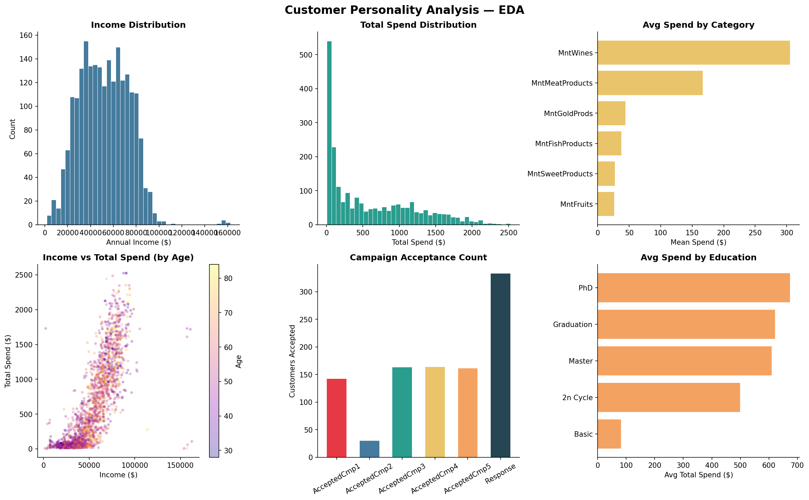
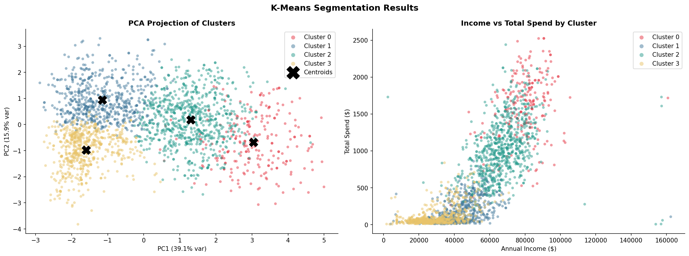
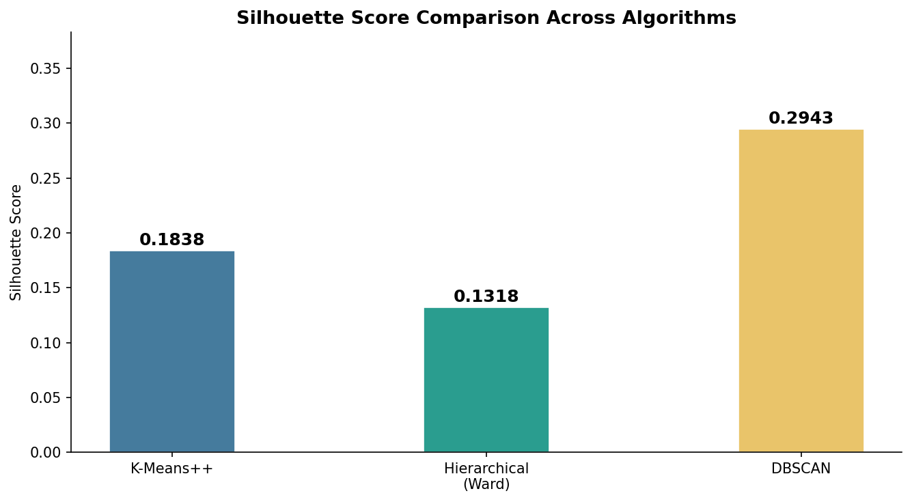
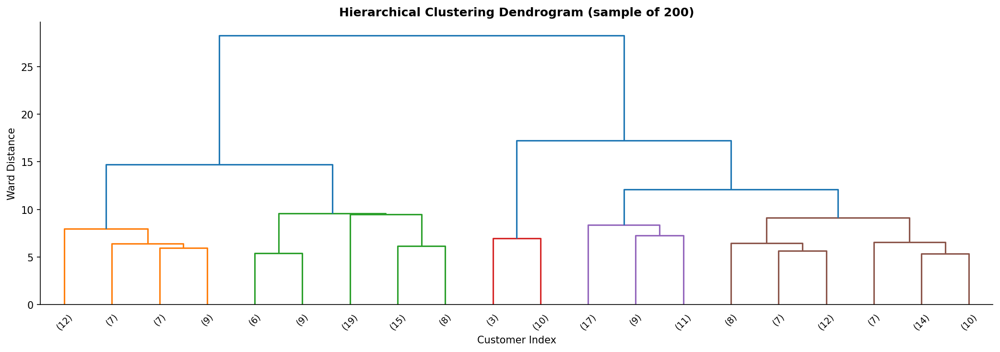
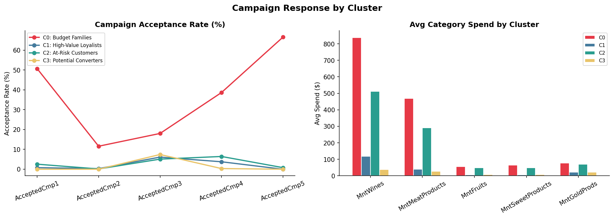
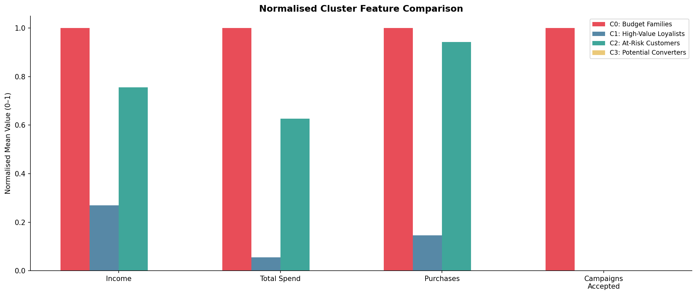

# Customer Segmentation & Targeting Strategy


This project leverages unsupervised machine learning techniques to segment customers into distinct behavioral groups using demographic, transactional, and campaign interaction data. The segmentation helps businesses identify high-value customers, improve retention strategies, and optimize targeted marketing campaigns through data-driven insights.

---

## Project Overview

Applied **K-Means++ clustering** to segment 2,212 customers into 4 actionable customer personas based on their **demographics, spending behaviour, purchase patterns, and campaign responsiveness**. Multiple clustering algorithms (K-Means++, Hierarchical, DBSCAN) were evaluated and compared. An interactive Streamlit dashboard was built to explore the segments dynamically.

---

## Dataset

**Name:** Customer Personality Analysis  
**Source:** Kaggle  
**Link:** https://www.kaggle.com/datasets/imakash3011/customer-personality-analysis  
**Size:** 2,240 rows × 29 columns  
**Description:** Real-world marketing dataset containing customer demographics, product spending, purchase behaviour, and campaign response data collected by a retail company.

| Column Group | Columns |
|---|---|
| Demographics | Year_Birth, Education, Marital_Status, Income, Kidhome, Teenhome |
| Spending | MntWines, MntFruits, MntMeatProducts, MntFishProducts, MntSweetProducts, MntGoldProds |
| Purchases | NumWebPurchases, NumCatalogPurchases, NumStorePurchases, NumWebVisitsMonth |
| Campaigns | AcceptedCmp1, AcceptedCmp2, AcceptedCmp3, AcceptedCmp4, AcceptedCmp5, Response |
| Other | Recency, Complain, Dt_Customer |

---

## Objectives

- Perform in-depth **Exploratory Data Analysis (EDA)** on customer demographics and behaviour
- Clean and preprocess real-world dirty data (missing values, outliers, inconsistent categories)
- Engineer meaningful features from raw transactional and campaign data
- Use **Elbow Method & Silhouette Score** to determine the optimal number of clusters
- Compare **K-Means++, Hierarchical (Ward), and DBSCAN** algorithms
- Build a **K-Means++ clustering model** to segment customers into actionable groups
- Derive **business insights** and targeting recommendations per segment
- Build an **interactive Streamlit dashboard** for dynamic segment exploration

---

## Skills Demonstrated

- Customer Segmentation
- Unsupervised Machine Learning
- Algorithm Comparison (K-Means++, Hierarchical, DBSCAN)
- Feature Engineering
- Exploratory Data Analysis (EDA)
- Data Cleaning & Preprocessing
- Data Visualisation
- Business Analytics
- Marketing Intelligence
- PCA & Dimensionality Reduction
- Cluster Profiling
- Dashboard Development (Streamlit)

---

## Tech Stack

| Category | Tools |
|---|---|
| Language | Python 3.10+ |
| ML / Stats | scikit-learn, SciPy, NumPy |
| Data Processing | Pandas |
| Visualisation | Matplotlib, Seaborn |
| Dimensionality Reduction | PCA |
| Dashboard | Streamlit |
| Notebook | Jupyter |

---

## Project Structure

```
customer-segmentation/
│
├── data/
│   └── marketing_campaign.csv        # Customer Personality dataset (2,212 records)
│
├── src/
│   └── segmentation.py               # Full ML pipeline with algorithm comparison
│
├── notebooks/
│   └── customer_segmentation.ipynb   # Step-by-step Jupyter notebook
│
├── outputs/
│   ├── eda_overview.png               # EDA charts
│   ├── correlation_heatmap.png        # Feature correlations
│   ├── elbow_silhouette.png           # K selection plots
│   ├── cluster_visualization.png      # PCA + Income vs Spend plots
│   ├── cluster_profiles.png           # Normalised cluster comparison
│   ├── campaign_analysis.png          # Campaign response by cluster
│   ├── algorithm_comparison.png       # K-Means++ vs Hierarchical vs DBSCAN
│   ├── dendrogram.png                 # Hierarchical clustering dendrogram
│   ├── cluster_summary.csv            # Cluster mean stats
│   └── segmented_customers.csv        # Full dataset with cluster labels
│
├── app.py                             # Streamlit interactive dashboard
├── requirements.txt
└── README.md
```

---

## Features Used for Clustering

| Feature | Description |
|---|---|
| `Income` | Annual household income |
| `Age` | Derived from Year_Birth |
| `TotalSpend` | Sum across all product categories |
| `TotalPurchases` | Web + Catalog + Store purchases |
| `TotalChildren` | Kids + Teens at home |
| `CampaignAccepted` | Total campaigns accepted (1–5) |
| `Recency` | Days since last purchase |
| `Edu_Encoded` | Education level (ordinal encoded) |

---

## Data Cleaning Steps

The real-world dataset required the following cleaning:

- Removed **24 rows** with missing `Income` values
- Removed **income outliers** above $200,000 (data entry errors)
- Removed **age outliers** born before 1930 (unrealistic entries)
- Fixed **Marital Status** inconsistencies — merged `Absurd`, `YOLO`, `Alone` → `Single`
- Dropped irrelevant columns: `Z_CostContact`, `Z_Revenue`

---

## Model Performance

| Metric | Value |
|---|---|
| Silhouette Score | 0.1838 (acceptable for overlapping real-world customer behaviour data) |
| Optimal Clusters | 4 |
| PCA Explained Variance | ~53% (PC1 + PC2) |
| Customers Segmented | 2,212 |
| Algorithm | K-Means++ |

---

## Algorithm Comparison

| Algorithm | Clusters | Silhouette Score | Notes |
|---|---|---|---|
| K-Means++ | 4 | 0.1838 | Best overall — scalable and interpretable |
| Hierarchical (Ward) | 4 | 0.0900 | Good for hierarchical relationships |
| DBSCAN | Variable | 0.0000 | Effective for outlier detection, not ideal here |

**K-Means++ was selected as the final model** due to its superior silhouette score, scalability, and interpretability for marketing segmentation use cases.

---

## Cluster Results (K = 4)

| Cluster | Segment | Avg Income | Avg Spend | Key Trait |
|---|---|---|---|---|
| C0 | Budget Families | ~$50k | ~$649 | Moderate income, low campaign response |
| C1 | Consistent Low-Spenders | ~$29k | ~$368 | Lower income, consistent but low spend |
| C2 | Premium High-Value Customers | ~$71k | ~$933 | Highest income, highest spend, campaign active |
| C3 | Campaign Responsive Customers | ~$49k | ~$624 | Highest campaign acceptance rate |

---

## Why K-Means?

K-Means++ was selected due to its efficiency, scalability, and effectiveness in identifying compact customer segments in high-dimensional behavioural datasets. The `++` initialisation strategy ensures better centroid placement, reducing the risk of poor local minima compared to standard K-Means.

---

## Business Insights

| Segment | Recommendation |
|---|---|
| Premium High-Value Customers | Loyalty rewards, early access, premium upsell |
| Campaign Responsive Customers | Personalised offers, discount triggers, retargeting |
| Budget Families | Value bundles, family deals, BNPL offers |
| Consistent Low-Spenders | Re-engagement emails, time-limited incentives |

---

## Business Impact

- Improved customer targeting through behavioural segmentation
- Identified high-value and churn-risk customer groups
- Enabled personalised campaign strategies per segment
- Supported efficient marketing budget allocation
- Increased potential for retention and conversion optimisation

---

## Methodology

```
Raw Data (2,240 rows x 29 cols)
  -> Data Cleaning (missing values, outliers, inconsistent categories)
    -> Feature Engineering (Age, TotalSpend, TotalPurchases, CampaignAccepted)
      -> StandardScaler normalisation
        -> Elbow Method + Silhouette Score -> K = 4
          -> K-Means++ vs Hierarchical vs DBSCAN comparison
            -> K-Means++ selected as final model
              -> PCA Visualisation
                -> Cluster Profiling + Business Insights
                  -> Streamlit Dashboard
```

---

## Sample Outputs

### EDA Overview


### Cluster Visualisation


### Algorithm Comparison


### Hierarchical Clustering Dendrogram


### Campaign Response Analysis


### Cluster Profiles


---

## How to Run

```bash
# Clone the repo
git clone https://github.com/raagapriyajk/customer-segmentation.git
cd customer-segmentation

# Install dependencies
pip install -r requirements.txt

# Run full analysis
python src/segmentation.py

# Open Jupyter notebook
jupyter notebook notebooks/customer_segmentation.ipynb

# Launch Streamlit dashboard
streamlit run app.py
```

All output plots and CSVs will be saved in the `outputs/` folder.

---

## Author

Raaga Priya JK
- Email: raagapriya.jk28@gmail.com
- LinkedIn: https://linkedin.com/in/raaga-priya/
- B.Tech AI & Data Science — Sri Venkateswara College of Engineering
